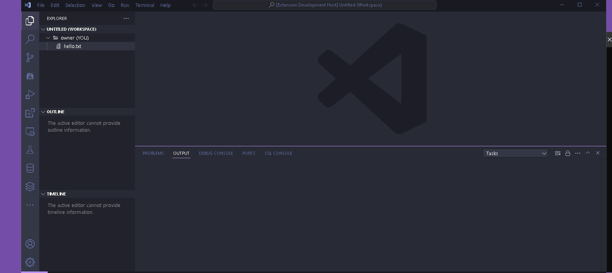
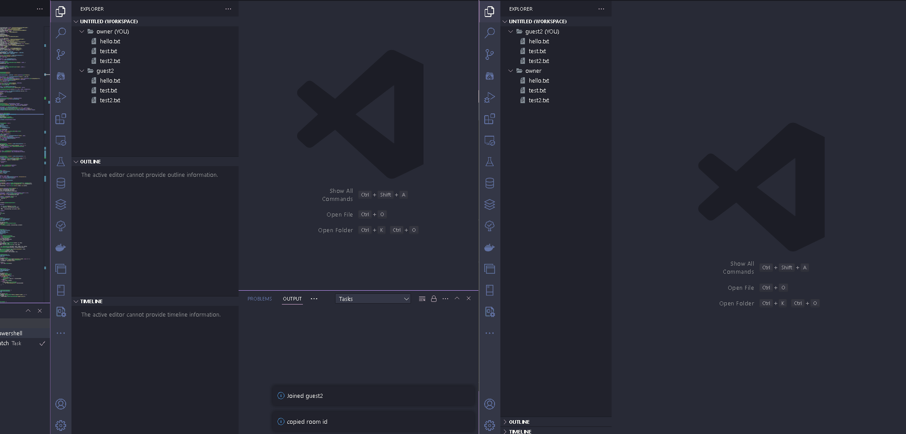
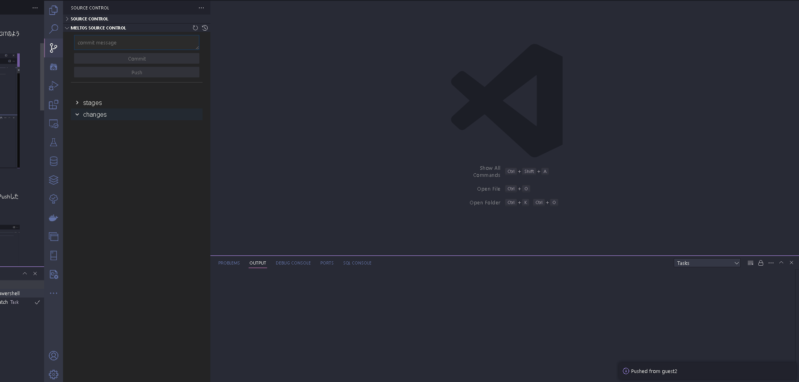
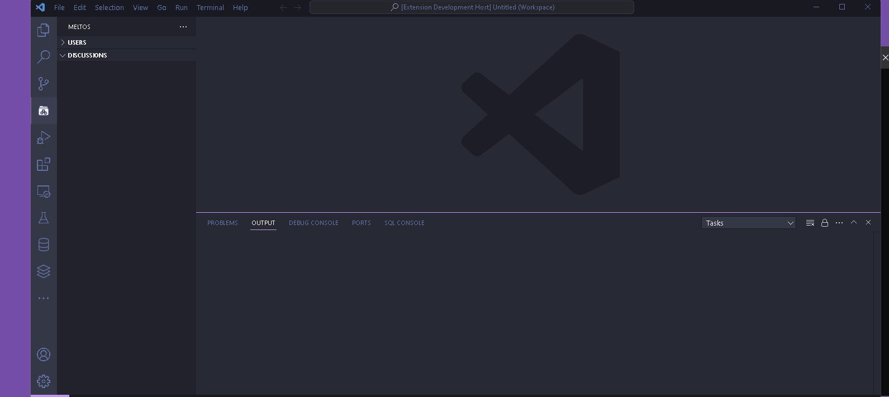

# meltos(プロトタイプ版)

※ 現状実験的に公開しており、予告なく使用できなくなる可能性があります。ご留意ください。

meltosを使用することで一時的な共用スペース（ルーム）を簡単に作成できます。
各ルームにはIDが割り当てられており、オーナーはこのIDを公開することでユーザーがルームに参加することが出来ます。

ルームに参加している状態でワークスペース、またはウィンドウが閉じられると自動的にルームから退出されます。

## ルームの機能

現時点ではTVCを使ったバージョン管理とディスカッションの2つの機能が使用できます。

### TVC (Temporary Version Control)

ルームオーナーによって共有されたディレクトリがバージョン管理対象となります。
ユーザーごとにブランチが作成され、GITのようにpushやマージができます。

他のユーザーの作業内容も確認でき、ユーザーのpushを検出して自動的に最新の状態に更新されます。

例えば、下記は左がオーナー、右がゲストユーザーのウィンドウになります。
ゲストユーザーが新規ファイルを作成してPushした際にオーナー側のワークスペースも更新されていることが確認できます。

***左がオーナー 右がゲストユーザーのウィンドウ***

コミット履歴からマージができます。
ただし、現状は強制的に変更を取り込むようになっておりコンフリクトの検査などは行われません。

### ディスカッション

ルーム内のユーザー全員を対象に簡単なディスカッションが作成できます。

## Usage

### オーナー側

ルームをたてる場合、`meltos:Open Room`を実行します。この際、ファイルダイアログが開かれます。指定したディレクトリはバージョン管理対象となりルームユーザーに公開されるため注意してください。

ルームが正常に立てられるとワークスペースが新規に作成されます。
`meltos Copy Room Id`でルームIDをクリップボードにコピーできます。コピーしたIDを参加させたいユーザーに共有してください。

### クライアント側

`meltos Join Room`を実行し、オーナーから共有されたルームIDを入力してください。

### Commands

| command | description |
| - | - |
| meltos: Open Room  |  Open New Room |
| meltos: Join Room | Join the Room |
| meltos: Copy Room Id | Copy Room Id to Clipboard  |
